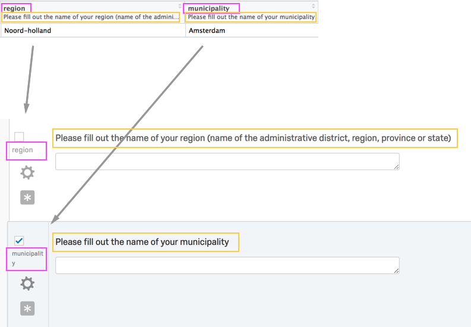

```{r setup, include = FALSE}
knitr::opts_chunk$set(
collapse = TRUE,
comment = "#>"
)
```

[Qualtrics](https://www.qualtrics.com/) is an online survey and data collection software platform. Qualtrics is used across many domains in both academia and industry for online surveys and research. While users can manually download survey responses from Qualtrics through a browser, importing this data into R is then cumbersome. The qualtRics R package implements the retrieval of survey data using the Qualtrics API and aims to reduce the pre-processing steps needed in analyzing such surveys. 

Note that your institution must support API access and that it must be enabled for your account. Whoever manages your Qualtrics account can help you with this. Please refer to the [Qualtrics documentation](https://api.qualtrics.com/instructions/) to find your API token.

The authors and contributors for this R package are not affiliated with Qualtrics and Qualtrics does not offer support for this R package.

## Usage

Currently, the package contains three core functions:

1. `all_surveys()` fetches a list of all surveys that you own or have access to from Qualtrics.
2. `fetch_survey()` downloads a survey from Qualtrics and loads it into R.
3. `read_survey()` allows you to read CSV files you download manually from Qualtrics.

It also contains helper functions:

1. `qualtrics_api_credentials()` stores your API key and base url in environment variables.
2. `survey_questions()` retrieves a data frame containing questions and question IDs for a survey; `extract_colmap()` retrieves a similar data frame with more detailed mapping from columns to labels.
3. `metadata()` retrieves metadata about your survey, such as questions, survey flow, number of responses etc.

Note that you can only export surveys that you own, or to which you have been given administration rights.

## Registering your Qualtrics credentials

There are two important credentials you need to authenticate with the Qualtrics API. These are your **API key** and **institution-specific base URL**. The base URL you pass to the qualtRics package should either look like `yourdatacenterid.qualtrics.com` or like `yourorganizationid.yourdatacenterid.qualtrics.com`, without a scheme such as `https://`. The [Qualtrics API documentation](https://api.qualtrics.com/instructions/) explains how you can find your base URL.

You can store your API credentials `QUALTRICS_API_KEY` and `QUALTRICS_BASE_URL` in your `.Renviron` file for repeated use across sessions. The qualtRics package has a function to help with this.

```{r, eval=FALSE}
library(qualtRics)

qualtrics_api_credentials(api_key = "<YOUR-QUALTRICS_API_KEY>", 
                          base_url = "<YOUR-QUALTRICS_BASE_URL>",
                          install = TRUE)
```

After you use this function, reload your environment (`readRenviron("~/.Renviron")`) so you can use the credentials without restarting R.

## A simple Qualtrics workflow

Once your Qualtrics API credentials are stored, you can see what surveys are available to you.

```{r, eval=FALSE}
surveys <- all_surveys() 
```

You can then download the data from any of these individual surveys (for example, perhaps the sixth one) directly into R.

```{r, eval=FALSE}
mysurvey <- fetch_survey(surveyID = surveys$id[6], 
                         verbose = TRUE)
```

## More detailed control

You can add date parameters to only retrieve responses between certain dates:

```{r, eval=FALSE}
mysurvey <- fetch_survey(surveys$id[4],
                         start_date = "2018-10-01",
                         end_date = "2018-10-31",
                         label = FALSE)
```


Note that your date and time settings may not correspond to your own timezone. You can find out how to do this [here](https://www.qualtrics.com/support/survey-platform/managing-your-account/research-core-account-settings/#user-settings). See ["Dates and Times"](https://api.qualtrics.com/instructions/) for more information about how Qualtrics handles dates and times. **Keep in mind that this is important if you plan on using times / dates as cut-off points to filter data**.

You may also reference a response ID; `fetch_survey()` will then download all responses that were submitted after that response:

```{r eval=FALSE}
mysurvey <- fetch_survey(surveys$id[4],
                         last_response = "R_3mmovCIeMllvsER",
                         label = FALSE,
                         verbose = TRUE)
```


You can filter a survey for specific questions:


```{r eval=FALSE}
# what are the questions in a certain survey?
questions <- survey_questions(surveyID = surveys$id[6])

# download that survey, filtering for only certain questions
mysurvey <- fetch_survey(surveyID = surveys$id[6],
                         save_dir = tempdir(),
                         include_questions = c("QID1", "QID2", "QID3"),
                         verbose = TRUE)
```


You can store the results in a specific location if you like:

```{r, eval=FALSE}
mysurvey <- fetch_survey(surveyID = surveys$id[6], 
                         save_dir = "/users/Julia/Desktop/", 
                         verbose = TRUE)
```

Note that surveys that are stored in this way will be saved as an [RDS](https://stat.ethz.ch/R-manual/R-devel/library/base/html/readRDS.html) file rather than e.g. a CSV. Reading an RDS file can be done like so:

```{r, eval=FALSE}
mysurvey <- readRDS(file = "/users/Julia/Desktop/mysurvey.rds")
```


You can read a survey that you downloaded manually from Qualtrics' website via a browser using `read_survey()`:

```{r, eval=FALSE}
mysurvey <- read_survey("/users/Julia/Desktop/mysurvey.csv")
```


To avoid special characters (mainly periods) in header names, `read_survey()` uses question labels as the header names. The question belonging to that label is then added using the [sjlabelled](https://CRAN.R-project.org/package=sjlabelled) package. Qualtrics gives names to these labels automatically, but you can easily change them.

```{r, echo=FALSE, out.width="80%"}

```

